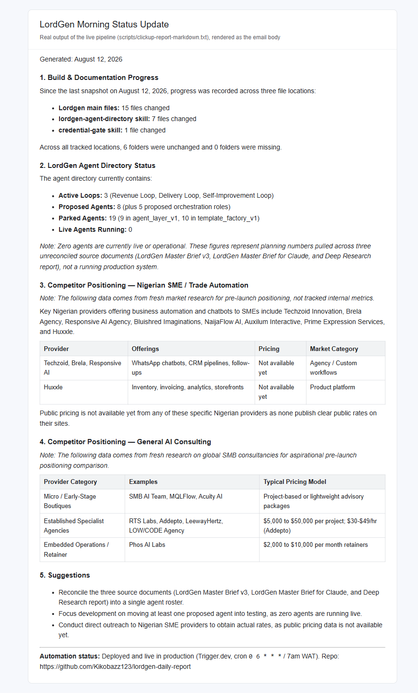
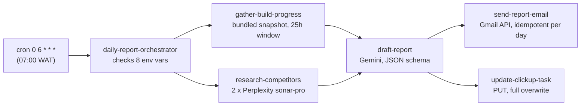

# lordgen-daily-report

A scheduled Trigger.dev job that emails a one-person agency owner a morning report:
what changed in their own build folders in the last day, plus fresh competitor
research, drafted into a readable brief.

Built by **[Lordmark Dorgu](https://github.com/Kikobazz123)** · MIT licensed.



---

## The problem it solves

Working alone across several side projects, it is easy to lose track of what
actually moved yesterday, and competitor research only happens when there is time
for it, which is never. This job does both every morning at 07:00 WAT and puts the
result where it will be read: the inbox, plus a ClickUp task that always holds the
latest report.

## Stack

TypeScript (ESM) · Trigger.dev v4 (scheduled and child tasks, retries, idempotency
keys) · Perplexity Sonar API · Google Gemini API (JSON-schema output) · Gmail API with
OAuth refresh tokens · ClickUp API · GitHub Actions for deployment

## Architecture



Each step is its own Trigger.dev task, called in sequence with `triggerAndWait`, so
a failure shows exactly which step broke and retries only that step.

```
src/trigger/lordgen-daily-report/
  daily-report-orchestrator.ts   the schedule; runs the steps in order
  gather-build-progress.ts       diffs the bundled folder snapshot
  research-competitors.ts        two Perplexity queries (local SMEs, AI consultancies)
  draft-report.ts                Gemini drafts subject + HTML, text and markdown bodies
  send-report-email.ts           Gmail send as multipart MIME
  update-clickup-task.ts         overwrites one ClickUp task with the report
  state/                         the snapshot JSON bundled into the deployment
scripts/
  refresh-progress-snapshot.ts   walks local folders, writes the snapshot (run before deploy)
  gmail-oauth-setup.ts           one-time Gmail refresh-token minting
  test-trigger.ts                fire one task with a payload and poll to completion
  sample-*.json                  payloads for test-trigger
```

## Run locally

```bash
npm install
cp .env.example .env               # fill in; every variable is documented there
npm run gmail-oauth-setup          # once, to mint GMAIL_REFRESH_TOKEN
npm run dev                        # Trigger.dev dev server
npm run test-trigger -- draft-report @scripts/sample-draft-input.json
```

The orchestrator refuses to start unless all eight service variables are set. The
deployed task needs the same variables in the Trigger.dev dashboard. Pushing to
`master` deploys via `.github/workflows/deploy.yml`, which needs a
`TRIGGER_ACCESS_TOKEN` repository secret.

## Tests

There is no automated test suite. Each task is exercised by hand with
`npm run test-trigger` and the sample payloads in `scripts/`, which is the honest
state of this project, not a claim of coverage.

## Design decisions and trade-offs

- **A bundled snapshot instead of reading the disk.** The deployed task runs in
  Trigger.dev's cloud and cannot see the local machine. `refresh-progress-snapshot`
  records folder file counts and latest modification times into JSON that ships with
  the deployment. The cost is freshness: the report is only as current as the last
  redeploy. It is the seam where a live source (a git API, a sync) would plug in.
- **The JSON is imported, not read with `fs`.** The bundler inlines imported JSON;
  files only referenced through `readFileSync` do not reach the build output.
- **Idempotency on the email only.** The send uses a global-scope key,
  `lordgen-report-YYYY-MM-DD`, so a manual retrigger or a duplicate cron fire cannot
  send twice in a day. A run-scoped key would not have deduplicated across runs. The
  ClickUp step is a full overwrite, so repeating it is harmless and it has no key.
- **Sequential research calls.** Two Perplexity calls in parallel tripped the
  account's per-second rate limit; running them one after another costs a few seconds
  and removes the failure.
- **`gemini-flash-latest` instead of a pinned model.** Dated model names get retired
  for new accounts; the alias trades reproducibility for not breaking silently.
- **25-hour lookback on a 24-hour schedule.** A small overlap so a change made just
  before the previous run is not lost to cron jitter.
- **Retries on in dev as well as production.** Transient `fetch failed` errors showed
  up locally, so both environments retry three times with exponential backoff.

Known limitations: the snapshot script walks hardcoded Windows paths on the author's
machine, the ClickUp task id is a constant in `update-clickup-task.ts`, and the Gemini
key is passed as a URL query parameter, which is how that endpoint accepts it but
means it can appear in request logs.
